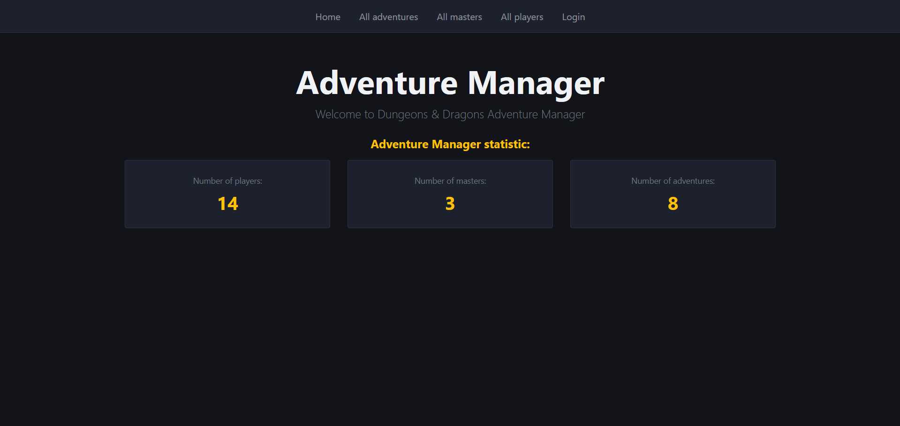
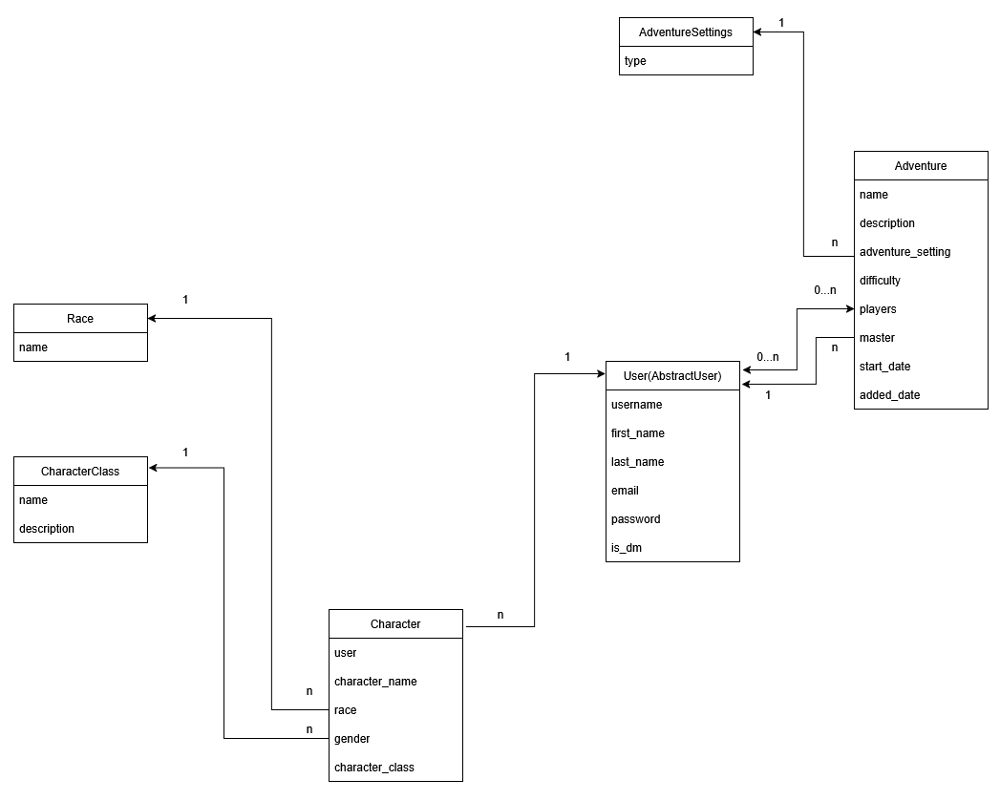

# D&D Adventure Manager

A web application built with Django for managing tabletop role-playing game (TTRPG) adventures, character creation, and player matchmaking.

## Installation

```bash
git clone https://github.com/ArGus20/adventure-manager
cd adventure-manager
python3 -m venv venv
source venv/bin/activate  # On Windows use: venv\Scripts\activate
pip install -r requirements.txt
python manage.py migrate
python manage.py createsuperuser
python manage.py runserver
```

## Features

* Authentication & Roles: Built-in user authentication with distinction between regular players and Dungeon Masters (is_dm).
* Character Management: Create and customize characters by selecting name, gender, race, and character class.
* Adventure Organization: Schedule and manage sessions with difficulty ratings, settings, designated Masters, and participating players.
* Data Customization: Full administrative control over races, character classes, and adventure settings via a powerful admin panel.

You can use the following superuser account or create a new one yourself:
```
Username: admin.user
Password: 1qazcde3
```

To log in as a player, use:
```
Username: travis_player
Password: 8765_password_1234
```

To log in as a dungeon master, use:
```
Username: matthew_dungeon_master
Password: 8765_password_1234
```

## Demo


## Live Demo
<https://adventure-manager.onrender.com/>


## Diagram
